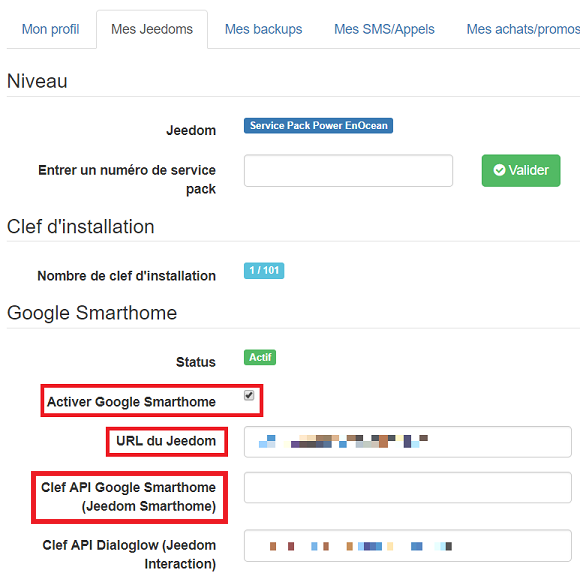
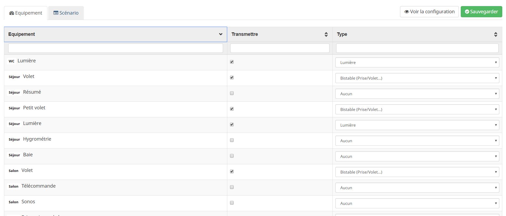
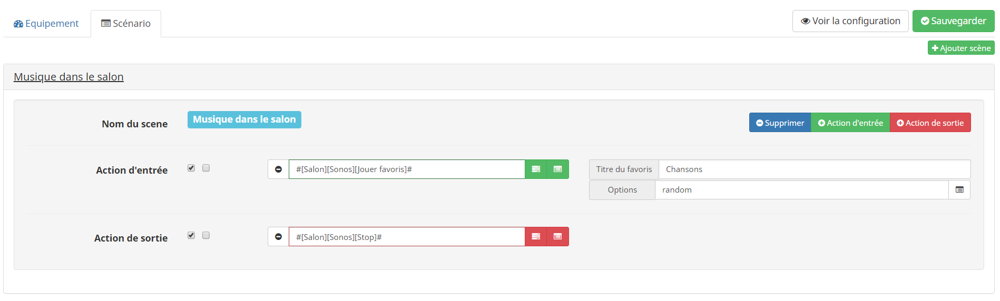
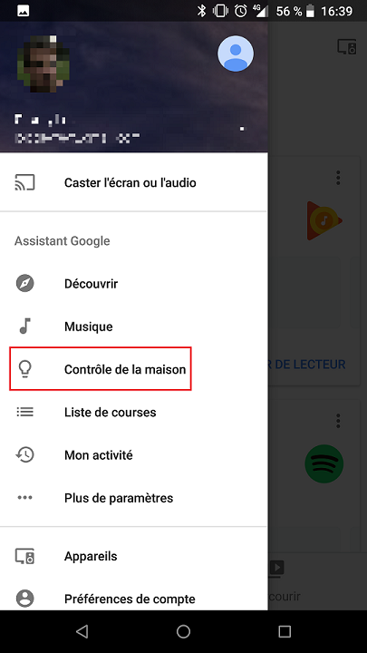
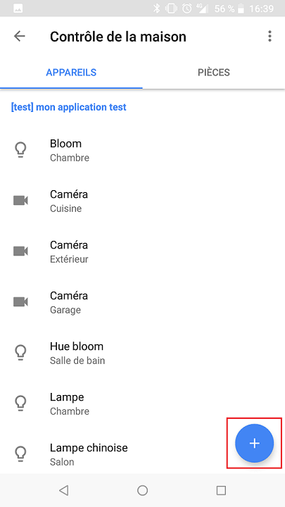
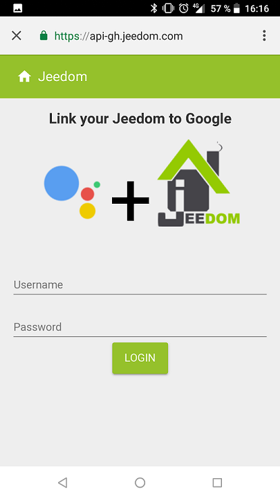

# Description

Ce plugin permet de faire le lien entre votre Jeedom, un service Google Smarthome et votre Google Smarthome.

Il peut fonctionner suivant 2 manières : 

- hebergé chez vous avec une application que vous ajoutez côté Google (cette méthode ne sera pas décrite ici)
- en passant par un service cloud mis à disposition par Jeedom

# Mise en place de la connexion vers Google Smarthome

> **IMPORTANT**
>
> Il est important de faire les étapes suivantes dans l'ordre indiqué !!!

## Configuration Market

Après l'installation du plugin, il vous suffit d'aller dans le menu Administration de Jeedom, puis Configuration, cliquer sur l'onglet API et de récupérer (copier) la clef API du plugin Google Smarthome.

Ensuite allez sur le Market depuis votre navigateur (et pas depuis Jeedom), dans votre profil partie "Mes Jeedoms", il faut que vous complétiez les champs "Google Smarthome" : 

- Activez le service google Smarthome
- Donnez l'url de votre Jeedom (https obligatoire)
- Mettez la clef API précédemment récuperée

Validez ensuite la configuration. 

Il vous faut maintenant attendre 24h le temps que votre demande soit prise en compte. (Status Actif en vert)

> **IMPORTANT**
>
> Suite à l'activation et/ou modification des informations pour Google Smarthome il faut attendre 24h pour que cela soit prise en compte

## Configuration du plugin

Sur votre Jeedom, allez sur Plugin -> Communication -> Google Smarthome et dans l'onglet Equipement sélectionnez les équipements à transmettre à Google ainsi que le type de l'équipement.

> **IMPORTANT**
>
> Le plugin se base sur les types génériques de Jeedom des commandes pour piloter votre domotique. Il est donc très important de configurer ceux-ci correctement!

> **NOTE**
>
> Pour le type "caméra" vous devez absolument configurer l'URL du flux (nous avons testé seulement le RTSP) pour que cela fonctionne.
> A noter que le support des caméras est pour le moment en beta.

Vous pouvez aussi créer des scènarios dans l'onglet Scènario, avec des actions d'entrée et de sortie.

## Configuration Google

Depuis votre téléphone, lancez l'application Google Home puis dans le Menu (à gauche) cliquez sur "Contrôle de maison" :

Cliquez sur le "+" et cherchez "Jeedom Smarthome" dans la liste :

Une fois sélectionné entrez vos identifiants Market :

L'application va normalement se synchroniser avec vos équipements, vous pourrez ensuite les déplacer dans les pièces de votre choix et piloter vocalement votre domotique.

# FAQ

>**Lors de la connexion j'ai eu page blanche avec du texte bizarre ?**
>
>Votre mot de passe ou nom d'utilisateur n'est pas reconnu. Avez-vous bien activé Google Smarthome sur le Market ? Avez-vous bien mis une URL(HTTPS) ? Avez-vous bien mis une clef API pour Google Smarthome ? Avez-vous bien attendu 24h suite à cela ? Entrez-vous correctment vos identifiants Market ?

>**Quelles sont les commandes possibles ?**
>
>Les commandes vocales (ainsi que les retours) sont gérés uniquement par Google, voilà la [documentation](https://support.google.com/googlehome/answer/7073578?hl=fr)

>**L'assistant me demande d'affecter les pièces mais je ne sais pas à quoi correspond l'équipement.**
>
>Oui l'assistant n'affiche pas le nom réel de l'équipement, juste le pseudo. Il faut donc quitter l'assistant et revenir sur la page d'acceuil du contrôle de la maison. Là en cliquant sur l'équipement vous allez avoir son nom, vous pourrez ensuite l'affecter à une pièce

>**Pourquoi faut-il affecter des pièces à chaque équipement ?**
>
>Car Google ne permet pas de le faire par l'API, vous devez donc absolument le faire manuellement.

>**Pourquoi faut-il attendre 24h pour que l'activation de Google Smarthome soit en place ?**
>
>Car nous avons dédié un serveur juste pour faire le pont entre votre Jeedom et Google Home, et celui-ci ne se synchronise que toutes les 24h avec le Market.

>**Google ne fait pas toujours ce que je dis**
>
> Effectivement lors de nos tests nous avons rencontré des soucis assez gênant : les pluriels et les genres.
> Exemple : "Ok google ferme tous les volets" ne marchera pas à cause du 's' à volets alors que "Ok google ferme volet" marchera.

>**Comment faire pour resynchroniser les équipements avec Google**
>
> En lisant simplement le message lors d'une sauvegarde sur la page du plugin, il vous indiquera comment faire.
